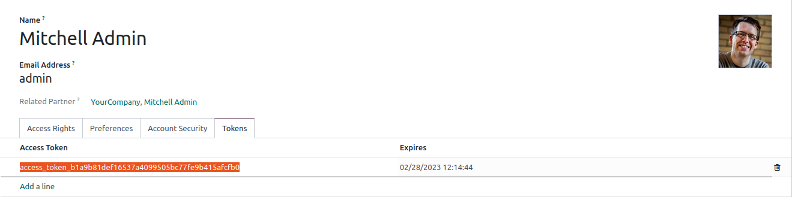
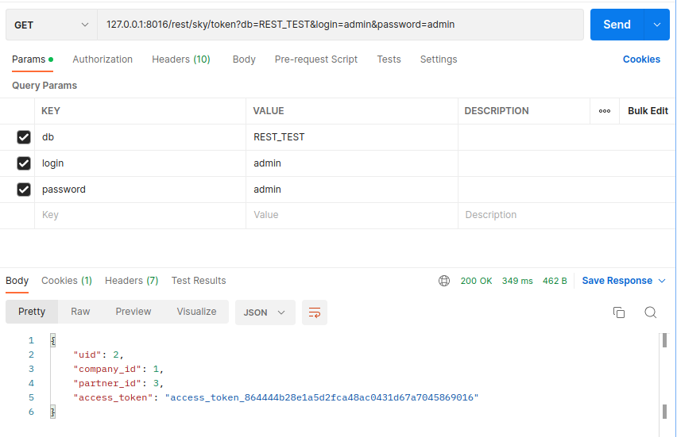
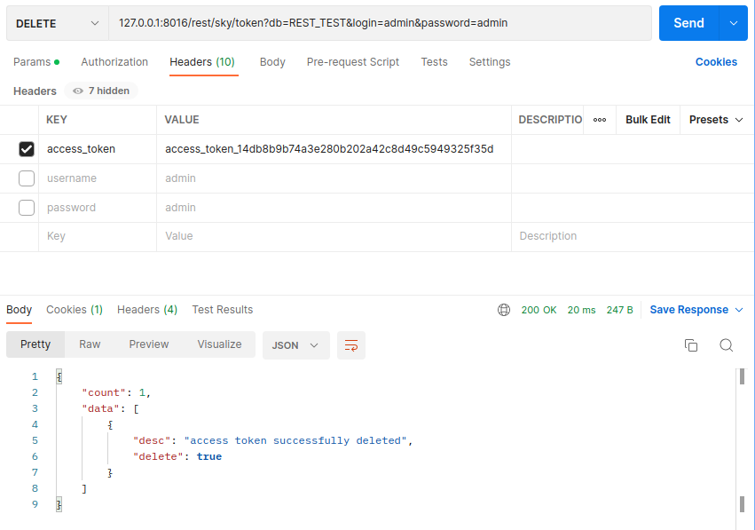

# ODOO API REST

Ce module permets d'ajouter une couche REST sur Odoo.


## AUTHENTIFICATION:

* Ce module permet au utilisateur de Se connecter directement via un jeton.

## REQUEST ACCESS TOKEN EN BACKEND:

* Créer le jeton à partir de la fiche de l'utilisateur, sur la page token.




## GET / REQUEST ACCESS TOKEN :

Python requêt

```python
import requests

url = "http://127.0.0.1:8016/api/auth/token"

payload = {
  "db":"REST_TEST",
  "login": "admin",
  "password": "admin"
}

headers = {
    'content-type': "multipart/form-data;",
    'access-token': "access_token_ebb1914bbdb5622cd782a1a0ff51f81a2cba042a"
    }

response = requests.request("GET", url, data=payload)

print(response.text)
```

Pour récupérer un jeton d'accès, ces paramètres suivants doivent être définis.

* le nom de la base de données comme **db**
* le nom d'utilisateur de connexion comme **login**
* le mot de passe utilisateur comme **password**

La requête ci-dessus renverra une réponse comme ci-dessous.

```python
{"uid": 2, "company_id": 1, "partner_id": 3,
 "access_token": "access_token_b1a9b81def16537a4099505bc77fe9b415afcfb0"}
```

Sur Postman



## DELETE / SUPPRIMER UN JETON D'ACCÈS:

* Supprimer le jeton existant en fournissant le jeton sur l'en-tête de la requête http 
    Exemple: url = 127.0.0.1:8016/rest/sky/token, method= DELETE, header={'access_token': 'weoiruoewr234234kjhewfsdf324d'}

Par requête python

```python
import requests

url = "http://127.0.0.1:8016/api/auth/token"

payload = {
  "db":"REST_TEST",
  "login": "admin",
  "password": "admin"
}

headers = {
    'content-type': "multipart/form-data;",
    'access-token': "access_token_b1a9b81def16537a4099505bc77fe9b415afcfb0"
    }

response = requests.request("DELETE", url, data=payload, headers=headers)

print(response.text)
```

La requête ci-dessus renverra une réponse comme ci-dessous.

```python
{"count": 1, "data": [{"desc": "access token successfully deleted", "delete": true}]}
```

Postman requêt



NB : Le token dispose par défaut d'une durée d'expiration d'une semaine.


## CONTRIBUTEURS:

  * Otman elagy <el.otman@Karizma.ma>

  * Assable Polo <p.assable@karizma.ma>

## MAINTENEURS:

Ce module est maintenu par le KARIZMA CONSULTING GROUP.


